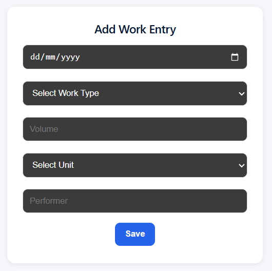
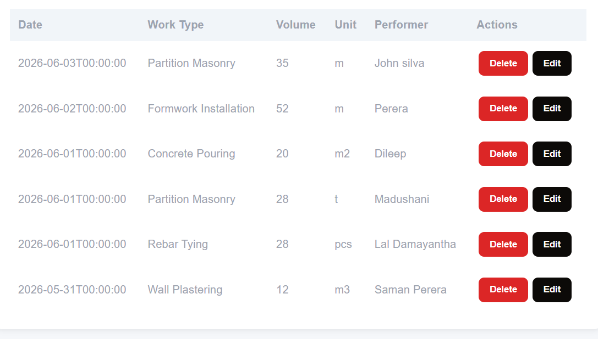
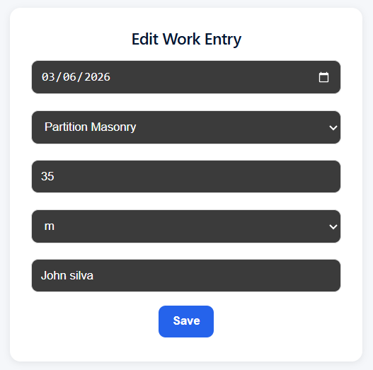
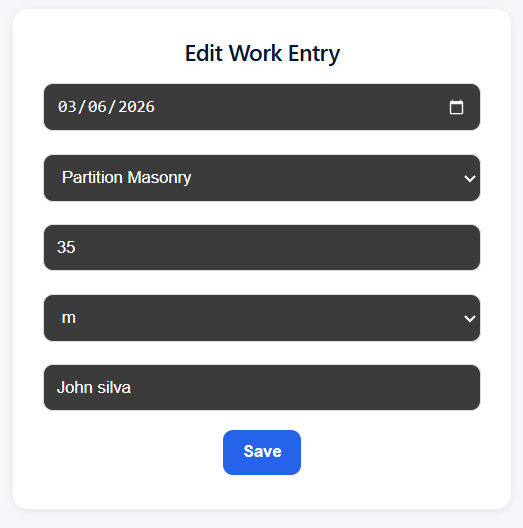

# Construction Site Work Log

## 📌 Project Overview

Construction Site Work Log is a full-stack internal tool designed to track daily construction activities performed on-site.

A foreman can:
- Add daily work entries
- View all recorded work
- Filter entries by date range
- Edit existing records
- Delete incorrect entries

The system ensures structured tracking of construction progress and improves site reporting efficiency.


## 🛠 Tech Stack

### Frontend
- React
- TypeScript
- Axios
- Vite

### Backend
- ASP.NET Core Web API (.NET 7)
- Entity Framework Core

### Database
- Microsoft SQL Server

### Tools
- Swagger (API testing)
- Git & GitHub


## 🏗 Architecture

Frontend (React + TypeScript)
        ↓
REST API (ASP.NET Core Web API)
        ↓
Entity Framework Core
        ↓
SQL Server Database


## 🚀 Features

### Core Features
- Create a work entry with validation
- View all work entries in a structured table
- Delete incorrect entries
- Edit existing entries

### Filtering
- Filter work entries by date range (from / to)
- Quick weekly or monthly review support via date filtering logic

### Data Integrity
- Backend validation using Data Annotations
- Frontend validation to prevent invalid submissions
- Ensures volume, date, and required fields are always valid

### UI/UX
- Responsive dashboard layout (desktop + mobile)
- Card-based layout for better structure
- Dropdown-based controlled inputs (Work Type, Unit)


## ⚙️ Setup Instructions

### Backend Setup (.NET API)

1. Navigate to backend folder
```bash
cd backend
```

2. Restore dependencies:
```bash
dotnet restore

```

3. Apply database migrations:
```bash
dotnet ef database update
```

4. Run backend:
```bash
dotnet run
```

📍 Backend runs at:
```plaintext
http://localhost:5058
```

### 💻 Frontend Setup (React + TypeScript)

1. Navigate to frontend folder:
```bash
cd frontend
```

2. Install dependencies:
```bash
npm install
```

3. Start development server:
```bash
npm run dev
```

📍 Frontend runs at:
```plaintext
http://localhost:5173
```


## 🔌 API Endpoints

### Work Entries API

1. Get all work entries:
```plaintext
GET /api/workentries
```

2. Create new work entry:
```plaintext
POST /api/workentries
```

3. Update work entry:
```plaintext
PUT /api/workentries/{id}
```

4. Delete work entry:
```plaintext
DELETE /api/workentries/{id}
```

5. Filter by date range
```plaintext
GET /api/workentries?from=2026-01-01&to=2026-01-31
```

✔ Supports:
- from (start date)
- to (end date)
- sorting by latest entries


## 📸 Screenshots

### Add Work Entry Form


---

### Work Entries Table


---

### Edit Functionality


---

### Date Filtering



## 📈 Future Improvements

- Add authentication and role-based access (Admin / User)
- Add pagination for large datasets
- Improve UI using a component library (Material UI / Tailwind CSS)
- Add Docker support for containerized deployment
- Deploy backend and frontend to cloud (Azure / AWS)
- Add audit logs for work entry changes


## 👤 Author

**Duleesha Gamalathge**  
Full Stack Developer

GitHub: https://github.com/DuleeshaGamalathge  
LinkedIn: https://www.linkedin.com/in/duleesha-gamalathge/